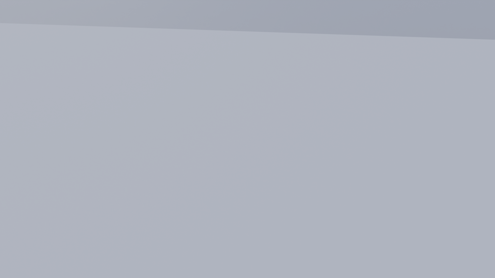

# Kickdom Arena — main stadium asset

Game-ready stadium for **PLAY KICKDOM – Ball Characters**, built procedurally in Blender
(`build_stadium.py`, Blender 5.x API) from the concept art: elongated-octagon arena, grey
concrete barrier with neon team strips and chevrons, hexagonal neon goals with nets and crown
emblems, two-tier stands with 2 905 ball-character fans, LED rim with floodlight grids,
geometric roof truss with hanging crown banners, and the neon-lit base plinth.



## Files

| File | Use it for |
| --- | --- |
| `KickdomArena.blend` | Editable source. Opens directly in Blender 5.2.1. Collections mirror the list below. |
| `KickdomArena.glb` | Complete stadium incl. every fan as a node (instanced meshes). Drop-in for engines that batch instances themselves. |
| `KickdomArena_NoFans.glb` | Structure, goals, seats, lights, roof, collision. **Recommended** — instance the fans from the library at runtime so they can animate. |
| `KickdomArena_ArenaOnly.glb` | Pitch + barrier + goals only (menus, thumbnails, low-end devices). |
| `KickdomFans_Library.glb` | The 16 fan variant meshes (team × pose × jersey × LOD) at the origin. |
| `fans_placement.json` | Placement table for the fans: mesh name, team, position, yaw, scale, row, deck. |
| `KickdomArena.fbx` | Same scene as FBX for Unity / Unreal pipelines that prefer it. |
| `build_stadium.py` | Regenerates everything (`--out` folder, `--no-render`, `--no-export`). |
| `previews/` | Cycles renders of the final asset. |

Everything is untextured, flat-shaded, low-poly with PBR colours baked into material slots
(no UV/texture dependencies, so it imports identically everywhere).

## Coordinate system & scale

* Units: **metres**. Blender is Z-up; the GLB/FBX are exported Y-up (standard).
* Origin: centre spot of the pitch, floor at `y = 0`.
* **Red goal at +X**, **blue goal at −X**. Stands run along ±Z (Blender ±Y).
* Pitch line box: 39 × 22 m (chamfered corners); wall centre-line spans ±24 m × ±16.6 m.
* Goal opening: 5.8 m wide × 3.1 m high hexagon, tunnel 3.6 m deep. Goal mouth centre ≈ `(±24, 1.6, 0)`.
* Barrier wall height 2.9 m (pillars 3.4 m). Stands: 9 + 8 rows, rise 0.62 m, run 1.45 m.
* Rim cap ≈ 24 m above the pitch, roof hub ring ≈ 43 m, base plinth extends 12.6 m below.
* Fan characters are ~1.75 m tall — size your player characters the same way (the reference
  rig `original_design_rigged.blend` is in this scale).

## Scene structure (collections / GLB node prefixes)

| Collection | Nodes | Notes |
| --- | --- | --- |
| `Arena` | `Arena_FloorSlab`, `Arena_FloorGrooves`, `Pitch_Lines` | Lines are geometry 12 mm above the floor. |
| `Barrier` | `Barrier_Panel_NN`, `Barrier_Pillar_NN` | Instanced panel/pillar variants (chevron panels near mid-line, slit pillars near goals). |
| `Goals` | `Goal_Red`, `Goal_Blue` | Single mesh each: hood, wings, neon tubes, net lattice, translucent floor, crown. |
| `Stands` | `Stands_Bowl`, `Stands_Aisles`, `Stands_NeonRibbons`, `Concourse_Ground` | |
| `Seats` | `Seat_NNNN` | 3 200 team-coloured seats (2 shared meshes). |
| `Fans` | `Fan_NNNN` | 2 905 fans, 16 shared meshes. Lower bowl = LOD0 (faces, brows, bandana tails), upper bowl = LOD1. |
| `RimAndFloodlights` | `Rim_Parapet`, `Rim_LEDBars`, `Facade_*`, `Floodlight_NN` | |
| `RoofTruss` | `Roof_Truss`, `Roof_Glow`, `Roof_Floodlight_NN` | Hide for top-down game cameras. |
| `Banners` | `Banner_NN` | Red/blue crown banners hanging from the ribs. |
| `BasePlinth` | `Base_Plinth`, `Base_NeonStrips` | The cross-section "floating arena" base. |
| `Collision` | `COL_PitchFloor`, `COL_BarrierWall`, `COL_Goal_Red`, `COL_Goal_Blue` | Hidden in render, `collision=True` custom prop; goal colliders are open boxes (ball enters from the pitch side). |
| `Lighting` | `Sun_Key`, `Sun_Fill` | Two sun lights for previews. |
| `PreviewCameras` | `Cam_*` | The cameras used for `previews/`. |

Custom properties on `KickdomArena_Root`: `units`, `pitch_size_m`, `red_goal`, `blue_goal`, `fans`.

## Materials (all Principled BSDF, colour-only)

`Concrete_Light / Concrete_Mid / Concrete_Dark`, `Pitch_Floor`, `Pitch_Groove`, `Pitch_Line`,
`Stand_Step`, `Stand_Riser`, `Concourse`, `Truss_Steel`, `Truss_Dark`, `Team_Red`, `Team_Blue`,
`Seat_Red`, `Seat_Blue`, `Fan_Body`, `Fan_Limb`, `White`, `Flag_Pole`, plus emissive materials
`Neon_Red`, `Neon_Blue`, `LED_White`, `Floodlight_Lamp`, `Net_Red`, `Net_Blue` and translucent
`GoalFloor_Red`, `GoalFloor_Blue`. Emissive strengths are exported via
`KHR_materials_emissive_strength` and are tuned for Cycles — in a real-time engine with bloom
scale them down (the web runtime uses ×0.4–0.5) and drive `Neon_*` / `LED_White` for pulses,
strobes and goal celebrations.

## Performance budget

| Content | Triangles |
| --- | --- |
| Structure (no fans) | ≈ 210 k |
| Fans, instanced (2 905 × 150–370) | ≈ 1.0 M on the GPU, 16 unique meshes |
| Whole scene (every instance counted) | ≈ 1.58 M |

The 2 905 fans must be rendered with GPU instancing (Unity SRP batcher / GPU instancing,
Unreal ISM/HISM, Godot `MultiMesh`, three.js `InstancedMesh`) — never as 2 905 draw calls.
`KickdomArena_NoFans.glb` + `KickdomFans_Library.glb` + `fans_placement.json` is the intended
runtime path; the web runtime in `lib/kickdom/` shows the complete implementation (idle bob,
jumps, Mexican wave, team celebrations).

## Engine notes

* **Unity** — import the GLB with glTFast / UnityGLTF (or the FBX). Set scale 1. Materials arrive as
  URP/HDRP Lit with emission; add Bloom (post-processing volume). Read `fans_placement.json`
  and spawn with `Graphics.RenderMeshInstanced` or a `MeshRenderer` prefab with GPU instancing.
  Convert Blender Z-up positions `(x, y, z)` → Unity `(x, z, y)` and mirror as needed for the
  left-handed axis (the GLB importers already do this for the nodes).
* **Unreal** — import the FBX (Y-up, scale 100 → cm is handled by "Convert Scene"). Emissive
  materials need bloom in the post-process volume. Fans → Hierarchical Instanced Static Mesh per
  variant.
* **Godot 4** — import the GLB directly; `COL_*` nodes can be converted to StaticBody3D shapes
  (or rename them `-col` before import). Fans → `MultiMeshInstance3D` per variant.
* **Web / three.js** — see `lib/kickdom/README.md` and the live page at `/kickdom`.

## Regenerating

```
# inside Blender 5.x: Scripting tab → open build_stadium.py → Run Script
# or headless:
blender -b -P build_stadium.py -- --out "3d models/Stadium" --samples 128 --res 1920
# or with the bpy module:
python build_stadium.py --out "3d models/Stadium"
```

Tune the layout at the top of the script (`P_WALL`, `PITCH_L/W`, `ROWS_LOW/UP`, `RISE/RUN`,
palette in `mat(...)` calls). The generator is deterministic (seeded), so fan placements are
reproducible.
